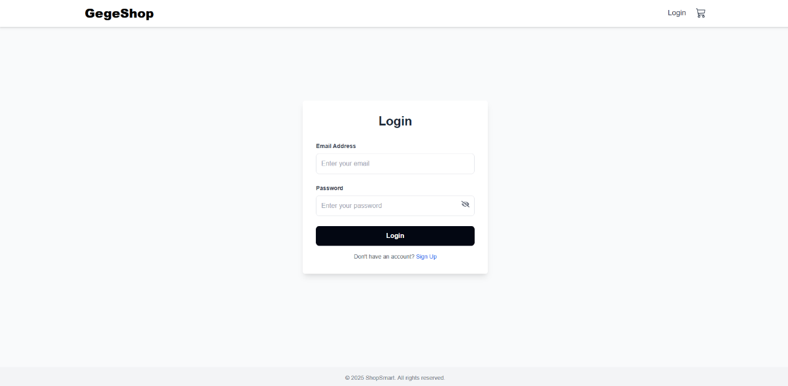
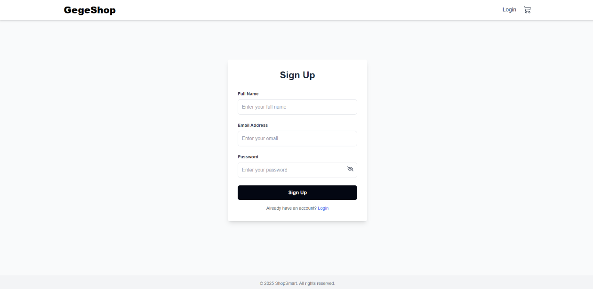
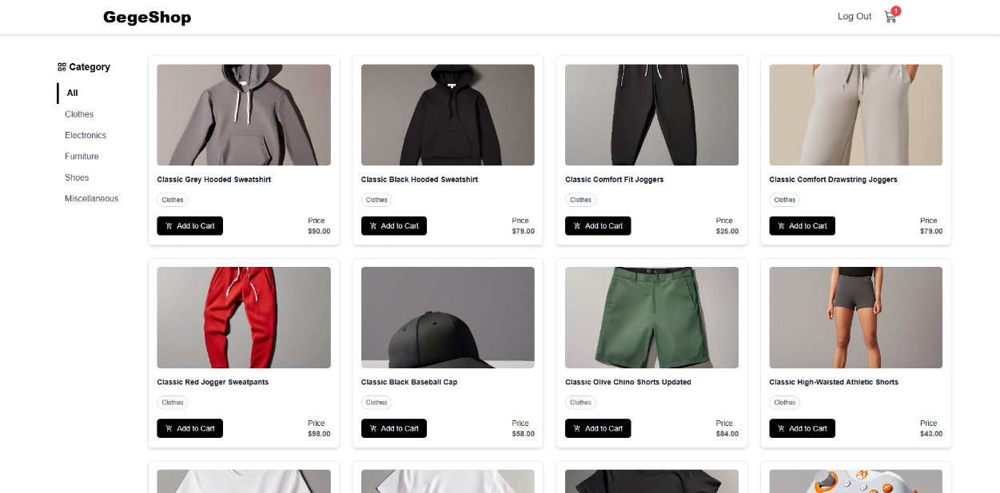
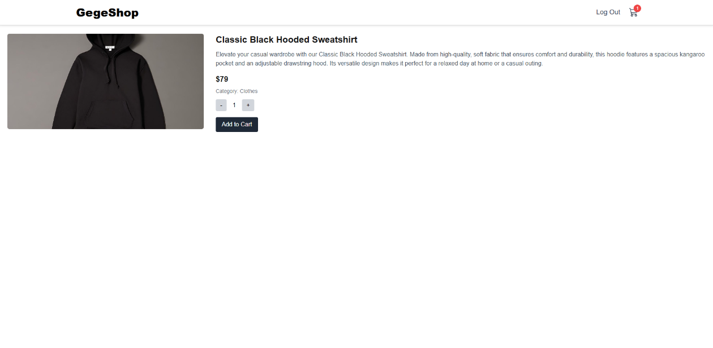
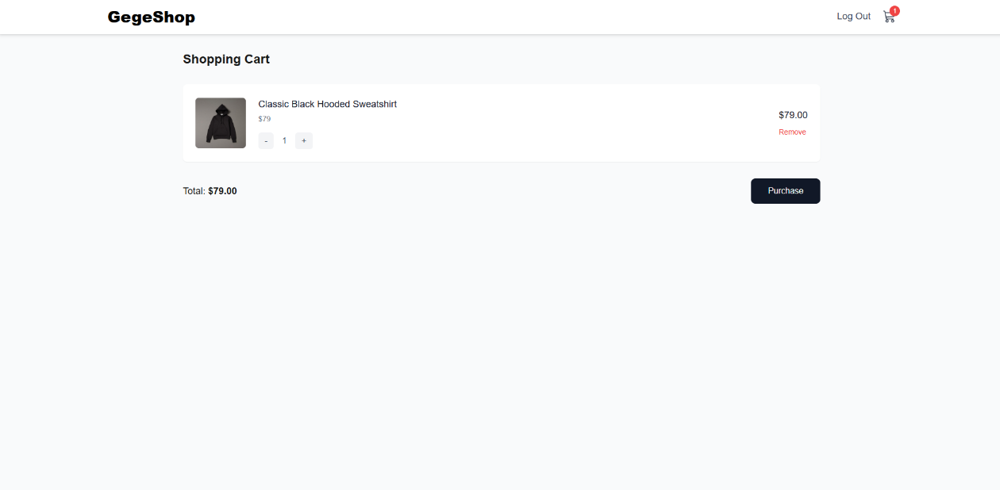

[](https://classroom.github.com/a/t4UX4h2e)

# GegeShop - E-Commerce Website

## Overview
GegeShop is a e-commerce website application built with Next.js. This project was created to fulfill the RevoU Module 5 assignment requirements.

## Live Demo
🌐 [Visit GegeShop](https://gegeshop.vercel.app/)

## Key Features 
### User Authentication
- Secure login system
- User registration/signup

### Product Management
- Filter products by categories
- View detailed product information
- Adjust product quantities
- Add items to shopping cart

### Shopping Cart
- Real-time cart management
- Adjust product quantities
- Remove items from cart
- Seamless checkout process

## Technologies Used
- **Frontend Framework:** Next.js
- **Styling:** Tailwind CSS
- **HTTP Client:** Axios
- **API Integration:** [Platzi Fake Store API](https://fakeapi.platzi.com/en/about/introduction/)
- **Deployment:** Vercel

## Getting Started

### Installation Steps
1. Clone the repository
   ```bash
   git clone https://github.com/revou-fsse-oct24/milestone-2-aizarfarhan25.git
   ```

2. Navigate to project directory
   ```bash
   cd module5
   ```

3. Install dependencies
   ```bash
   npm install
   ```

4. Start development server
   ```bash
   npm run dev
   ```

## Application Screenshots

### User Authentication
| Login Page | Sign Up Page |
|------------|--------------|
|||

### Shopping Experience
| Homepage | Product Detail | Shopping Cart |
|----------|----------------|---------------|
||||

## API Documentation
This project uses the Platzi Fake Store API for product data. For detailed API documentation, visit:
[Platzi API Documentation](https://fakeapi.platzi.com/en/about/introduction/)
This is a [Next.js](https://nextjs.org) project bootstrapped with [`create-next-app`](https://nextjs.org/docs/pages/api-reference/create-next-app).

## Getting Started

First, run the development server:

```bash
npm run dev
# or
yarn dev
# or
pnpm dev
# or
bun dev
```

Open [http://localhost:3000](http://localhost:3000) with your browser to see the result.

You can start editing the page by modifying `pages/index.tsx`. The page auto-updates as you edit the file.

[API routes](https://nextjs.org/docs/pages/building-your-application/routing/api-routes) can be accessed on [http://localhost:3000/api/hello](http://localhost:3000/api/hello). This endpoint can be edited in `pages/api/hello.ts`.

The `pages/api` directory is mapped to `/api/*`. Files in this directory are treated as [API routes](https://nextjs.org/docs/pages/building-your-application/routing/api-routes) instead of React pages.

This project uses [`next/font`](https://nextjs.org/docs/pages/building-your-application/optimizing/fonts) to automatically optimize and load [Geist](https://vercel.com/font), a new font family for Vercel.

## Learn More

To learn more about Next.js, take a look at the following resources:

- [Next.js Documentation](https://nextjs.org/docs) - learn about Next.js features and API.
- [Learn Next.js](https://nextjs.org/learn-pages-router) - an interactive Next.js tutorial.

You can check out [the Next.js GitHub repository](https://github.com/vercel/next.js) - your feedback and contributions are welcome!

## Deploy on Vercel

The easiest way to deploy your Next.js app is to use the [Vercel Platform](https://vercel.com/new?utm_medium=default-template&filter=next.js&utm_source=create-next-app&utm_campaign=create-next-app-readme) from the creators of Next.js.

Check out our [Next.js deployment documentation](https://nextjs.org/docs/pages/building-your-application/deploying) for more details.
